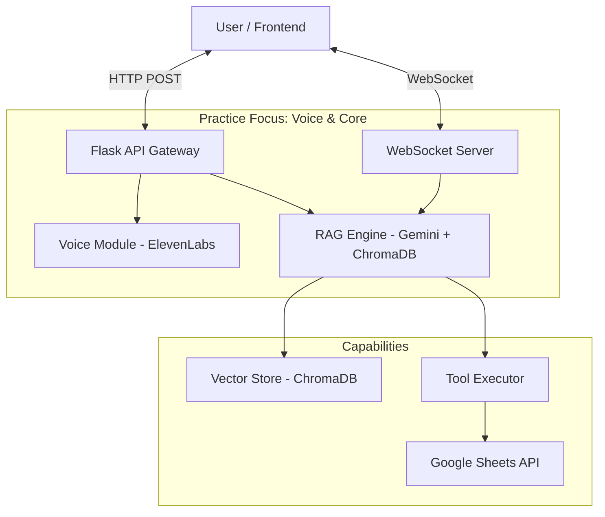

# VoiceRAG Lab

This project is a **practice framework** developed to explore the capabilities of modern LLMs and Voice AI. 

The primary goal of this project was to master **ElevenLabs integration** for creating realistic, conversational voice agents (Calling Implementation). It serves as a sandbox for testing:
1.  **Voice Interaction**: Implementing a full voice loop (STT -> LLM -> TTS) using ElevenLabs.
2.  **RAG Capabilities**: Testing how well the LLM retrieves and synthesizes information.
3.  **System Prompting**: Iterating on bot personas and behavior.

---

## 🏗️ Architecture Overview

The framework operates as a hybrid HTTP/WebSocket server. It demonstrates how to glue together different AI services into a cohesive application.



### Key Features (Learning Outcomes)
- **🎙️ ElevenLabs Voice Integration**: A robust implementation of **Speech-to-Text (STT)** and **Text-to-Speech (TTS)** to enable "Calling" features.
- **Multi-Mode RAG**: Ingest knowledge from **PDF/Docx Files**, **Raw Text**, or **Web Links**.
- **Dynamic System Prompts**: Modify the bot's persona and instructions in real-time via the UI.
- **Tool Use / Function Calling**: The LLM can autonomously decide to call Python functions (e.g., checking a calendar).
- **Real-Time WebSockets**: Supports streaming interaction patterns.

---

## 📂 Project Structure

```text
Chatbot-W/
├── backend/                  # Python Backend Logic
│   ├── app.py                # Main Entry Point (HTTP Server, Voice Routes)
│   ├── rag_core.py           # Core RAG Logic (Gemini Client, Vector Store)
│   ├── ws_server.py          # WebSocket Server for real-time chat
│   ├── ingestion_routes.py   # API Blueprints for loading data
│   ├── appointment_routes.py # API Wrapper for the Booking Tool
│   ├── apifunctions.py       # Google Sheets Integration Logic
│   ├── booking_tools.py      # Tool Definitions & Executor (Reference Impl)
│   └── utils.py              # Helpers (CORS, Metadata)
├── frontend/                 # User Interface
│   ├── index.html            # Main Dashboard
│   └── script.js             # Frontend Logic (VAD, Audio, API Calls)
├── data/                     # Storage for sample files/uploads
├── scripts/                  # Practice scripts for independent ElevenLabs STT/TTS testing
└── requirements.txt          # Python dependencies
```

---

## 🚀 Getting Started

### 1. Prerequisites
- **Python 3.11+**
- **Google Cloud API Key**: For Gemini Models (`gemini-2.0-flash` or similar).
- **ElevenLabs API Key**: For Voice capabilities.
- **Google Cloud Service Account**: (Optional) For the Appointment Booking demo.

### 2. Installation

1.  **Clone the repository**:
    ```bash
    git clone <repository-url>
    cd Chatbot-W
    ```

2.  **Create Virtual Environment**:
    ```bash
    python -m venv venv
    source venv/bin/activate  # Windows: venv\Scripts\activate
    ```

3.  **Install Dependencies**:
    ```bash
    pip install -r requirements.txt
    ```

### 3. Configuration (.env)

Create a `.env` file in the root directory. This file is **ignored by git** for security.

| Variable | Description | Required? |
| :--- | :--- | :--- |
| `GOOGLE_API_KEY` | Your Gemini API Key. | **Yes** |
| `ELEVENLABS_API_KEY` | Your ElevenLabs API Key. | **Yes** (for Voice) |
| `GOOGLE_CREDS_FILE` | Path to Google Service Account JSON (e.g., `backend/credentials.json`). | **No** (Only for Booking Demo) |
| `PORT` | HTTP Server Port (Default: `5200`). | No |

---

## 🏃 Running the Application

1.  **Start the Backend**:
    ```bash
    python backend/app.py
    ```
    - **HTTP Server**: `http://127.0.0.1:5200`
    - **WebSocket Server**: `ws://127.0.0.1:5201`

2.  **Launch the Frontend**:
    - Open `frontend/index.html` in your web browser.
    - The UI will automatically connect to `localhost:5200`.

---

## 📖 API Documentation

### 1. Chat & RAG
- **Endpoint**: `POST /chat`
- **Body**:
    ```json
    {
        "userMessage": "Hello",
        "systemPrompt": "You are a pirate.",
        "history": [...]
    }
    ```
- **Response**: Returns the LLM's text response, citation sources, and any tool outputs.

### 2. Ingestion
- **Endpoint**: `POST /ingest/all`
- **Description**: Universal endpoint to load data into the Vector Store.
- **Body (Multipart/Form-Data)**:
    - `files`: List of files (PDF, DOCX, TXT).
    - `data`: JSON string containing `textEntries` and `linkEntries`.

### 3. Voice
- **STT**: `POST /voice/stt` (Accepts audio file, returns text).
- **TTS**: `POST /voice/tts` (Accepts text, returns audio stream).

### 4. Tools (Reference Implementation)
- **Endpoint**: `GET /api/appointments/slots?date=YYYY-MM-DD`
- **Endpoint**: `POST /api/appointments/slots` (Book a slot)

---

## 🧪 Practice Scripts (Standalone Testing)

The `scripts/` directory contains standalone Python scripts used to test and understand the ElevenLabs API before integrating it into the main app. You can run these to verify your API keys and hear the TTS/STT in action.

- **Test Text-to-Speech (TTS)**:
  ```bash
  python scripts/tts-test.py
  ```
- **Test Speech-to-Text (STT)**:
  ```bash
  python scripts/stt-test.py
  ```

---

## 🛠️ Developer Guide: Extending the Framework

### Adding a New Tool
The framework is designed to be extensible. To add a new capability (e.g., "Check Weather"):

1.  **Define the Schema**:
    In `backend/booking_tools.py` (or a new file), define the JSON schema for Gemini:
    ```python
    WEATHER_TOOL = {
        "function_declarations": [{
            "name": "get_weather",
            "description": "Get current weather",
            "parameters": { ... }
        }]
    }
    ```

2.  **Implement the Logic**:
    Add the method to the `BookingToolExecutor` class:
    ```python
    def get_weather(self, city: str):
        return requests.get(f"weather.api/{city}").json()
    ```

3.  **Register the Tool**:
    In `backend/rag_core.py`, add your new tool definition to the `self.tools` list in `__init__`.

### Changing the LLM Model
Modify `backend/rag_core.py`:
```python
EMBEDDING_MODEL = "text-embedding-004"
CHAT_MODEL = "gemini-2.0-flash" # Change to gemini-pro, etc.
```

---

## ❓ Troubleshooting

- **Voice Not Working?**
    - Ensure `ELEVENLABS_API_KEY` is set in `.env`.
    - Check browser permissions for Microphone access.
- **"No available slots" Error?**
    - The Booking demo requires a valid Google Service Account with access to a specific Google Sheet. If you don't have this, the tool will fail gracefully or return mock errors.
- **Port Conflicts?**
    - If port 5200 is taken, change the `PORT` variable in `.env` and update `frontend/script.js` to match.
